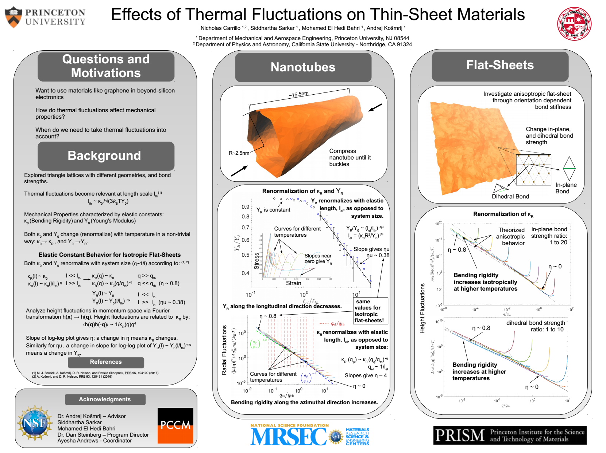

## Covid 19 New Cases and Deaths Dashboard

<iframe width="1140" height="530" src="https://app.powerbi.com/reportEmbed?reportId=9d4338b1-5dfa-475b-94e9-128839b48ac2&autoAuth=true&ctid=96db78cf-221e-423e-8d55-bcabc5bf9ba6&config=eyJjbHVzdGVyVXJsIjoiaHR0cHM6Ly93YWJpLXVzLW5vcnRoLWNlbnRyYWwtZy1wcmltYXJ5LXJlZGlyZWN0LmFuYWx5c2lzLndpbmRvd3MubmV0LyJ9" frameborder="1"></iframe>

### Description

This was a passion project to get myself to learn PowerBI by integrating it with some code I wrote in Python to predict general Covid 19 trends. The program analyzes the NYTimes Covid19 case/death data to construct a 7-day rolling average of cases and deaths within the U.S.A, and utilizes the Gaussian process regression algorithm in sci-kit learn to predict the trend for the next 7 days.

By default the entire U.S.A is selected, but mixing-and-matching states and counties can be done via the selection tab.

Data: [New York Times Covid Repo](https://www.nytimes.com/interactive/2020/us/coronavirus-us-cases.html)

## PCCM/PRISM Poster Presentation

## Master's Thesis in Physics

[Many Body Localization in 2D Systems with Quasi-Random fields in X and YDirections](https://arxiv.org/pdf/1911.11291.pdf)
